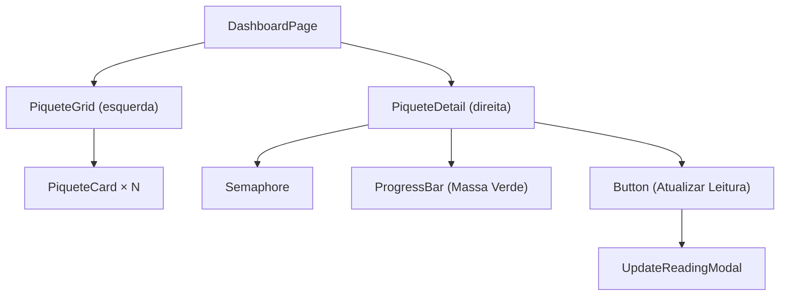
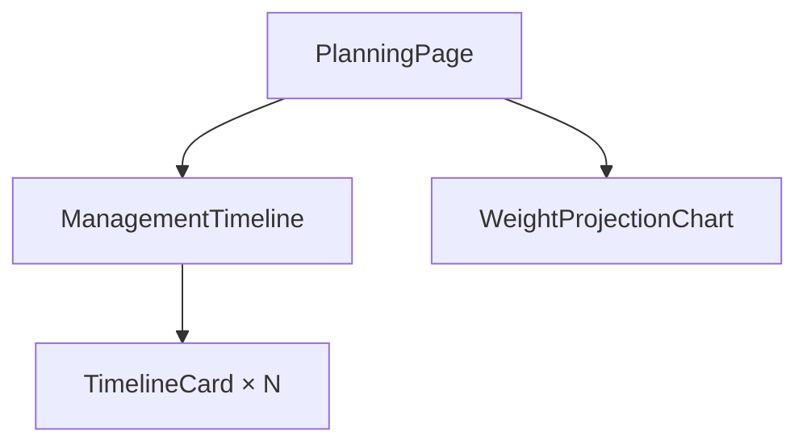
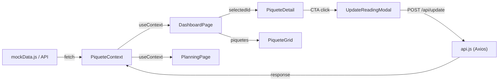

# Planejamento Frontend — MVP PastureAI

> Sistema de análise de ponto de carga animal em piquetes de pastagem.

---

## 1. Arquitetura de Pastas

```
src/
├── assets/                  # Ícones, imagens estáticas
├── components/
│   ├── ui/                  # Componentes genéricos reutilizáveis
│   │   ├── Button.jsx
│   │   ├── Badge.jsx
│   │   ├── ProgressBar.jsx
│   │   ├── Modal.jsx
│   │   └── Semaphore.jsx    # Indicador Verde/Amarelo/Vermelho
│   ├── dashboard/           # Componentes da Tela 1
│   │   ├── PiqueteGrid.jsx
│   │   ├── PiqueteCard.jsx
│   │   ├── PiqueteDetail.jsx
│   │   └── UpdateReadingModal.jsx
│   └── planning/            # Componentes da Tela 2
│       ├── ManagementTimeline.jsx
│       ├── TimelineCard.jsx
│       └── WeightProjectionChart.jsx
├── pages/
│   ├── DashboardPage.jsx    # Tela 1: Dashboard de Pastagens
│   └── PlanningPage.jsx     # Tela 2: Planejamento e Previsões
├── services/
│   └── api.js               # Funções Axios (POST /api/update, GETs)
├── data/
│   └── mockData.js          # Dados fictícios para desenvolvimento
├── hooks/
│   └── usePiquetes.js       # Hook customizado para lógica de piquetes
├── context/
│   └── PiqueteContext.jsx   # Context API (estado global dos piquetes)
├── App.jsx                  # Layout principal + rotas
├── main.jsx                 # Entry point Vite
└── index.css                # Tailwind directives + tokens globais
```

---

## 2. Mapeamento de Componentes

### Tela 1 — Dashboard de Pastagens (Master-Detail)



| Componente | Responsabilidade | Props Principais |
|---|---|---|
| `<DashboardPage />` | Layout split (grid 50/50). Mantém `selectedPiqueteId` local. | — |
| `<PiqueteGrid />` | Renderiza o grid de cards. | `piquetes[], onSelect(id)` |
| `<PiqueteCard />` | Quadrado individual no grid com nome e status resumido. | `piquete, isSelected, onClick` |
| `<PiqueteDetail />` | Painel direito com todos os dados do piquete selecionado. | `piquete` |
| `<Semaphore />` | Bolinha colorida (verde/amarelo/vermelho). | `status: 'green'|'yellow'|'red'` |
| `<ProgressBar />` | Barra de progresso da biomassa. | `value: number (0-100), label` |
| `<UpdateReadingModal />` | Modal com input de altura + upload de foto. Dispara POST. | `piqueteId, isOpen, onClose` |

### Tela 2 — Planejamento e Previsões



| Componente | Responsabilidade | Props Principais |
|---|---|---|
| `<PlanningPage />` | Layout vertical: Timeline no topo, Gráfico embaixo. | — |
| `<ManagementTimeline />` | Lista horizontal/vertical scrollável de cards de manejo. | `events[]` |
| `<TimelineCard />` | Card individual: data, ícone de ação, instrução, motivo. | `event` |
| `<WeightProjectionChart />` | Gráfico de barras (Recharts). Eixo X = Piquetes, Y = Kg ganhos. | `projections[]` |

---

## 3. Estrutura de Mock de Dados

```json
// mockData.js — Piquetes
{
  "piquetes": [
    {
      "id": "PIQ-01",
      "nome": "Piquete 01 - Baixada",
      "tamanhoHectares": 12,
      "statusSaude": "green",
      "ultimaAvaliacao": "2026-06-02T10:00:00Z",
      "ocupacao": {
        "quantidade": 35,
        "categoria": "Garrotes",
        "pesoMedioKg": 300
      },
      "massaVerdePct": 78
    },
    {
      "id": "PIQ-02",
      "nome": "Piquete 02 - Morro",
      "tamanhoHectares": 8,
      "statusSaude": "yellow",
      "ultimaAvaliacao": "2026-06-04T14:30:00Z",
      "ocupacao": {
        "quantidade": 22,
        "categoria": "Novilhas",
        "pesoMedioKg": 250
      },
      "massaVerdePct": 45
    },
    {
      "id": "PIQ-03",
      "nome": "Piquete 03 - Córrego",
      "tamanhoHectares": 15,
      "statusSaude": "red",
      "ultimaAvaliacao": "2026-05-28T08:00:00Z",
      "ocupacao": {
        "quantidade": 0,
        "categoria": null,
        "pesoMedioKg": null
      },
      "massaVerdePct": 12
    },
    {
      "id": "PIQ-04",
      "nome": "Piquete 04 - Chapada",
      "tamanhoHectares": 10,
      "statusSaude": "green",
      "ultimaAvaliacao": "2026-06-05T09:15:00Z",
      "ocupacao": {
        "quantidade": 40,
        "categoria": "Bois",
        "pesoMedioKg": 450
      },
      "massaVerdePct": 91
    }
  ]
}
```

```json
// mockData.js — Eventos de Manejo (Timeline)
{
  "eventos": [
    {
      "id": "EVT-01",
      "data": "2026-06-05",
      "labelData": "HOJE",
      "acao": "mover",
      "instrucao": "Mover rebanho do Piquete 01 para o Piquete 04",
      "motivo": "Piquete 01 atingiu limite de massa seca"
    },
    {
      "id": "EVT-02",
      "data": "2026-06-06",
      "labelData": "Amanhã",
      "acao": "descansar",
      "instrucao": "Manter Piquete 03 em descanso",
      "motivo": "Recuperação de biomassa em andamento (12% → meta 60%)"
    },
    {
      "id": "EVT-03",
      "data": "2026-06-10",
      "labelData": "Em 5 dias",
      "acao": "mover",
      "instrucao": "Rebanho está pronto para venda",
      "motivo": "Lote atingiu peso de abate projetado (480kg)"
    }
  ]
}
```

```json
// mockData.js — Projeções de Ganho de Peso (Gráfico)
{
  "projecoes": [
    { "piquete": "PIQ-01", "nome": "Baixada", "kgGanhos": 450 },
    { "piquete": "PIQ-02", "nome": "Morro", "kgGanhos": 280 },
    { "piquete": "PIQ-04", "nome": "Chapada", "kgGanhos": 620 }
  ]
}
```

---

## 4. Estratégia de Gerenciamento de Estado

### Estado Global — `PiqueteContext`

Usado para compartilhar dados dos piquetes entre as duas telas sem prop-drilling excessivo.

```
PiqueteContext
├── piquetes[]            ← lista completa de piquetes (do mock ou API)
├── eventos[]             ← eventos da timeline
├── projecoes[]           ← dados do gráfico
├── loading: boolean      ← flag de carregamento
├── updatePiquete(id, data) ← atualiza um piquete após leitura
└── refreshData()         ← re-fetch geral
```

> [!TIP]
> Para o MVP, `useContext` + `useReducer` é suficiente. Não há necessidade de Redux ou Zustand neste escopo.

### Estado Local (por componente)

| Componente | Estado Local | Tipo |
|---|---|---|
| `DashboardPage` | `selectedPiqueteId` | `useState<string \| null>` |
| `UpdateReadingModal` | `altura`, `imagemFile`, `isSubmitting` | `useState` cada |
| `PlanningPage` | — (consome apenas do contexto) | — |

### Fluxo de Dados



---

## 5. Roteamento

Duas rotas simples via `react-router-dom`:

| Rota | Página | Descrição |
|---|---|---|
| `/` | `DashboardPage` | Dashboard de Pastagens |
| `/planejamento` | `PlanningPage` | Planejamento e Previsões |

Navegação via sidebar fixa ou tabs no topo com ícones Lucide (`LayoutDashboard`, `CalendarClock`).

---

## 6. Serviço de API (`services/api.js`)

```
api.js
├── getPiquetes()           → GET  /api/piquetes
├── getEventos()            → GET  /api/eventos
├── getProjecoes()          → GET  /api/projecoes
├── updateLeitura(payload)  → POST /api/update  { image: File, altura: number, piqueteId: string }
```

> [!IMPORTANT]
> No MVP, todas as funções retornam dados do `mockData.js` com um `setTimeout` simulando latência de rede (~500ms). A troca para API real será apenas alterar os imports/URLs.

---

## 7. Bibliotecas e Versões

| Pacote | Finalidade |
|---|---|
| `react` + `react-dom` | Core |
| `react-router-dom` | Roteamento |
| `tailwindcss` | Estilização |
| `recharts` | Gráfico de barras (projeção de peso) |
| `axios` | HTTP client |
| `lucide-react` | Ícones (Move, Pause, Leaf, Beef, etc.) |
| `date-fns` | Formatação de datas relativas ("há 3 dias") |
