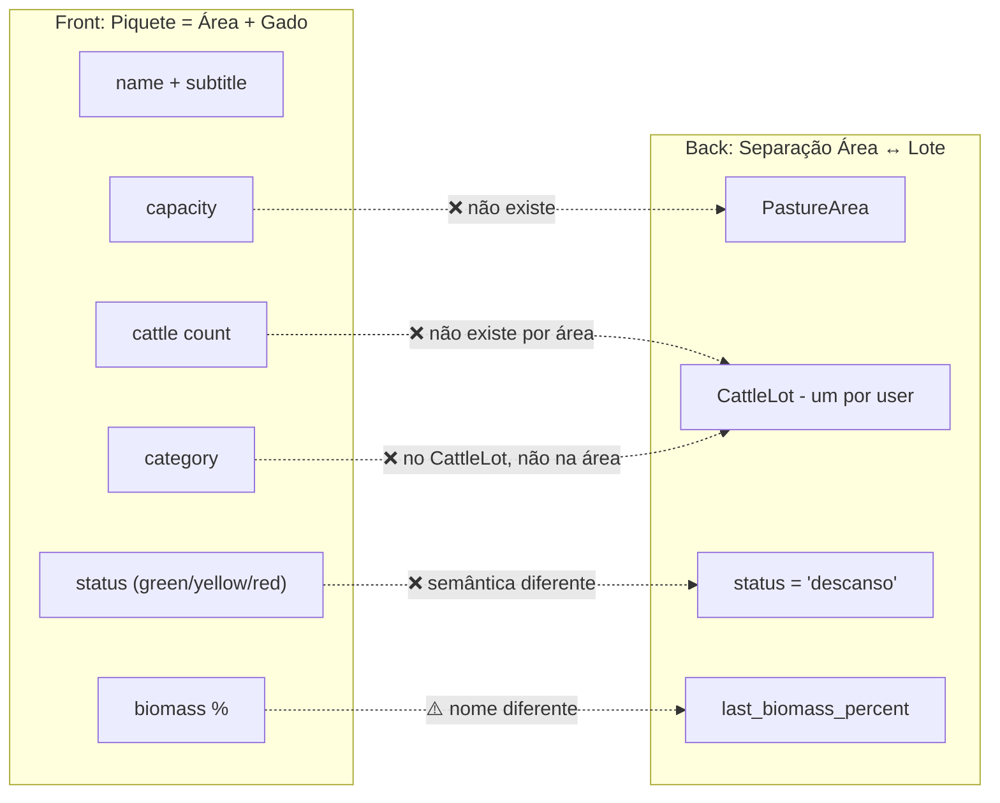
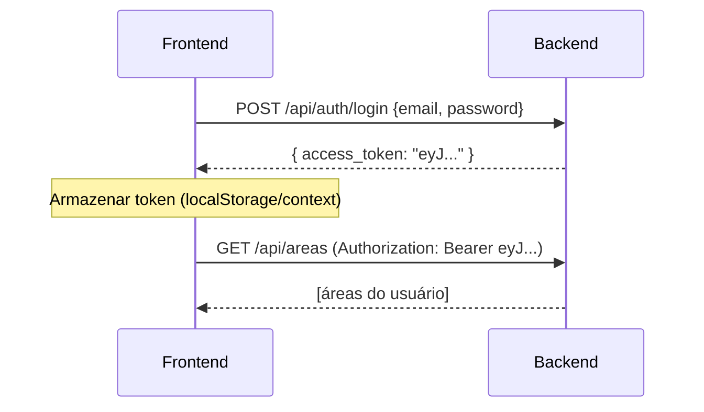
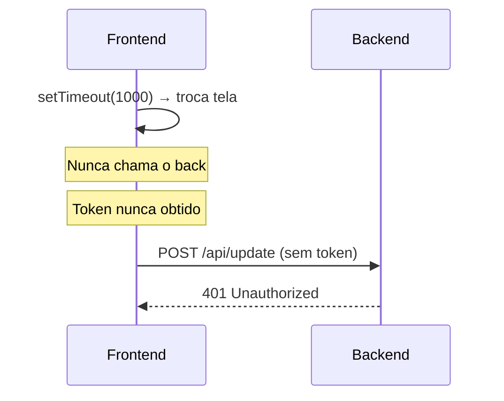

# Análise de Inconsistências Front-end × Back-end — PastoCerto

> [!IMPORTANT]
> Este documento lista **todas as inconsistências** identificadas entre o que o **frontend** espera consumir e o que o **backend** realmente entrega. Nenhum código foi alterado.

---

## Sumário

| # | Área | Severidade | Status |
|---|------|-----------|--------|
| 1 | [Login / Autenticação](#1-login--autenticação) | 🔴 Crítica | Front não chama API real |
| 2 | [Dashboard — Dados dos Piquetes](#2-dashboard--dados-dos-piquetes) | 🔴 Crítica | Dados 100% hardcoded no front |
| 3 | [Dashboard — Atualizar Leitura](#3-dashboard--atualizar-leitura) | 🔴 Crítica | Endpoint, formato e campos incompatíveis |
| 4 | [Planning — Timeline](#4-planning--timeline) | 🔴 Crítica | Dados hardcoded; contrato incompatível |
| 5 | [Planning — Gráfico de Peso](#5-planning--gráfico-de-peso) | 🔴 Crítica | Dados hardcoded; formato incompatível |
| 6 | [Planning — Impacto Econômico](#6-planning--impacto-econômico) | 🟡 Moderada | Não existe no back |
| 7 | [User Profile](#7-user-profile) | 🟡 Moderada | Sem endpoint no back |
| 8 | [Modelo de Dados — Piquete](#8-modelo-de-dados--piquete) | 🔴 Crítica | Campos totalmente diferentes |
| 9 | [SQL original vs. Back implementado](#9-sql-original-vs-back-implementado) | 🟡 Moderada | Schema SQL ignorado |
| 10 | [CORS e Headers](#10-cors-e-headers) | 🔴 Crítica | Back não configura CORS |
| 11 | [Token JWT — Armazenamento e Envio](#11-token-jwt--armazenamento-e-envio) | 🔴 Crítica | Front não armazena/envia token |

---

## 1. Login / Autenticação

### O que o Front faz ([Login.tsx](file:///c:/Users/gabri/OneDrive/Documentos/antigravitygit/50TonsDeClaude/front/src/app/components/Login.tsx))

```tsx
// Linha 13-20
const handleSubmit = (e: React.FormEvent) => {
  e.preventDefault();
  setIsLoading(true);
  // Simulate API call ← NÃO CHAMA A API
  setTimeout(() => {
    setIsLoading(false);
    onLogin(); // apenas troca tela
  }, 1000);
};
```

- **Não faz `POST` para nenhum endpoint.**
- **Não armazena `access_token`** em lugar algum (localStorage, context, etc.).
- **Não repassa o token** para chamadas subsequentes (sem `Authorization: Bearer ...`).

### O que o Back oferece ([app.py](file:///c:/Users/gabri/OneDrive/Documentos/antigravitygit/50TonsDeClaude/back/app.py#L156-L172))

| Endpoint | Método | Entrada | Saída |
|----------|--------|---------|-------|
| `/api/auth/login` | POST | `{ "email", "password" }` | `{ "access_token": "..." }` |
| `/api/auth/register` | POST | `{ "name", "email", "password" }` | `{ "msg": "..." }` |

### Inconsistências

| Item | Detalhe |
|------|---------|
| **Front não chama `/api/auth/login`** | `setTimeout` simula sucesso |
| **Front não armazena token** | Todas as rotas protegidas com `@jwt_required()` vão retornar 401 |
| **Front não tem tela de registro** | Existe link "Fale com um consultor" mas sem funcionalidade |
| **Front não trata erros de autenticação** | Sem exibição de "credenciais inválidas" |

---

## 2. Dashboard — Dados dos Piquetes

### O que o Front espera ([Dashboard.tsx](file:///c:/Users/gabri/OneDrive/Documentos/antigravitygit/50TonsDeClaude/front/src/app/components/Dashboard.tsx#L12-L35))

A interface `Piquete` do front define:

```typescript
interface Piquete {
  id: number;
  name: string;        // "Área 01"
  subtitle: string;    // "Baixada"
  area: number;        // 12
  status: "green" | "yellow" | "red";
  lastEval: string;    // "há 3 dias"
  cattle: number;      // 35
  category: string;    // "Garrotes 300kg"
  biomass: number;     // 78
  capacity: number;    // 45
}
```

**Os dados são 100% hardcoded** (`PIQUETES` constante com 9 itens).

### O que o Back retorna (`GET /api/areas`) ([app.py](file:///c:/Users/gabri/OneDrive/Documentos/antigravitygit/50TonsDeClaude/back/app.py#L197-L214))

```json
{
  "id": 1,
  "name": "Piquete 01 - Baixada",
  "area_hectares": 12.0,
  "grass_type": "Azevém",
  "status": "descanso",
  "last_estimated_biomass_kg": 8500.0,
  "last_biomass_percent": null,
  "last_measured_at": null
}
```

### Tabela comparativa campo a campo

| Campo Front | Campo Back | Compatível? | Problema |
|-------------|-----------|-------------|----------|
| `name` ("Área 01") | `name` ("Piquete 01 - Baixada") | ⚠️ Parcial | Formato diferente; front separa name/subtitle |
| `subtitle` ("Baixada") | ❌ Não existe | ❌ | Não existe no back |
| `area` | `area_hectares` | ⚠️ Parcial | Nome diferente |
| `status` ("green"/"yellow"/"red") | `status` ("descanso") | ❌ | Semântica completamente diferente. Back usa "descanso", não cores |
| `lastEval` ("há 3 dias") | `last_measured_at` (ISO datetime) | ⚠️ Parcial | Front espera texto amigável, back retorna ISO ou null |
| `cattle` (35) | ❌ Não existe em áreas | ❌ | Back não retorna contagem de gado por área |
| `category` ("Garrotes 300kg") | ❌ Não existe em áreas | ❌ | Back tem isso no `cattle_lot`, não por área |
| `biomass` (78) | `last_biomass_percent` | ⚠️ Parcial | Nome diferente; pode ser null |
| `capacity` (45) | ❌ Não existe | ❌ | Back não calcula capacidade de suporte |
| ❌ | `grass_type` | ❌ | Front ignora esse campo |
| ❌ | `last_estimated_biomass_kg` | ❌ | Front ignora esse campo |

> [!CAUTION]
> **6 dos 10 campos do front não existem no back**, e o front **nem chama** `GET /api/areas`. Tudo é hardcoded.

---

## 3. Dashboard — Atualizar Leitura

### O que o Front envia ([Dashboard.tsx](file:///c:/Users/gabri/OneDrive/Documentos/antigravitygit/50TonsDeClaude/front/src/app/components/Dashboard.tsx#L79-L106))

```typescript
const formData = new FormData();
formData.append("piqueteId", String(selected.id));
formData.append("altura", height);
if (photo) formData.append("imagem", photo);

await axios.post("/api/update", formData, {
  headers: { "Content-Type": "multipart/form-data" },
});
```

### O que o Back espera (`POST /api/area/update`) ([app.py](file:///c:/Users/gabri/OneDrive/Documentos/antigravitygit/50TonsDeClaude/back/app.py#L270-L367))

```json
{
  "area_id": 1,
  "height_cm": 19,
  "green_percent": 52,
  "recent_weather_condition": "chuva_leve",
  "image_base64": "data:image/jpeg;base64,..."
}
```

### Inconsistências

| Item | Front | Back | Problema |
|------|-------|------|----------|
| **URL** | `/api/update` | `/api/area/update` | ❌ Endpoint errado |
| **Content-Type** | `multipart/form-data` | `application/json` (`request.get_json()`) | ❌ Back não lê FormData |
| **ID da área** | `piqueteId` | `area_id` | ❌ Nome do campo diferente |
| **Altura** | `altura` | `height_cm` | ❌ Nome do campo diferente |
| **Imagem** | `imagem` (arquivo File) | `image_base64` (string base64) | ❌ Formato completamente diferente |
| **green_percent** | ❌ Não envia | Espera receber | ❌ Front não coleta este dado |
| **recent_weather_condition** | ❌ Não envia | Usa se receber | ⚠️ Front não coleta este dado |
| **Autenticação** | ❌ Sem token | `@jwt_required()` | ❌ Retornará 401 |
| **Resposta** | Ignora resposta | `{ biomass_percent, estimated_biomass_kg }` | ⚠️ Front não usa a resposta |

> [!WARNING]
> Este endpoint é a peça central da interação do usuário. **Nada funciona**: URL errada, formato errado, campos errados, sem autenticação.

---

## 4. Planning — Timeline

### O que o Front espera ([Planning.tsx](file:///c:/Users/gabri/OneDrive/Documentos/antigravitygit/50TonsDeClaude/front/src/app/components/Planning.tsx#L14-L97))

```typescript
interface TimelineEvent {
  id: number;
  date: string;       // "2026-06-06"
  dateLabel: string;   // "HOJE", "AMANHÃ", "EM 5 DIAS"
  urgent: boolean;
  action: "mover" | "descansar" | "venda";
  title: string;       // "Mover rebanho"
  detail: string;      // "Piquete 04 → Piquete 07"
  reason: string;
  piquete?: string;
  destino?: string;
}
```

**Dados 100% hardcoded** na constante `TIMELINE` (6 itens). **Não chama nenhuma API.**

### O que o Back retorna (`GET /api/evaluation` → `timeline`) ([app.py](file:///c:/Users/gabri/OneDrive/Documentos/antigravitygit/50TonsDeClaude/back/app.py#L468-L497))

```json
{
  "id": 1,
  "date": "2026-06-06",
  "day_offset": 0,
  "action": "mover",
  "from_area_id": 1,
  "from_area_name": "Piquete 01 - Baixada",
  "to_area_id": 2,
  "to_area_name": "Piquete 02 - Morro",
  "message": "Mover do Piquete 01 para Piquete 02...",
  "reason": "Biomassa restante insuficiente (< 3 dias)"
}
```

### Tabela comparativa

| Campo Front | Campo Back | Compatível? | Problema |
|-------------|-----------|-------------|----------|
| `dateLabel` ("HOJE") | ❌ Não existe | ❌ | Back não calcula labels relativos |
| `urgent` | ❌ Não existe | ❌ | Back não marca urgência |
| `action` ("mover"/"descansar"/"venda") | `action` ("mover"/"alerta"/"venda") | ⚠️ Parcial | Back usa `"alerta"` ao invés de `"descansar"` |
| `title` ("Mover rebanho") | ❌ Não existe | ❌ | Back não tem título separado |
| `detail` ("Piquete 04 → Piquete 07") | ❌ Não existe | ❌ | Back tem `message` com formato diferente |
| `piquete` | `from_area_name` | ⚠️ Parcial | Nomes/formatos diferentes |
| `destino` | `to_area_name` | ⚠️ Parcial | Nomes/formatos diferentes |
| `reason` | `reason` | ✅ Sim | Compatible |
| ❌ | `day_offset` | — | Front não usa |
| ❌ | `from_area_id` / `to_area_id` | — | Front não usa IDs numéricos |

---

## 5. Planning — Gráfico de Peso

### O que o Front espera ([Planning.tsx](file:///c:/Users/gabri/OneDrive/Documentos/antigravitygit/50TonsDeClaude/front/src/app/components/Planning.tsx#L99-L108))

```typescript
const WEIGHT_DATA = [
  { semana: "Sem 1", projetado: 450, realizado: 420 },
  { semana: "Sem 2", projetado: 890, realizado: 865 },
  // ... ganho acumulado total do rebanho em kg
];
```

- `semana`: label da semana ("Sem 1", "Sem 2", ...)
- `projetado`: ganho de peso **acumulado total** em kg
- `realizado`: ganho real acumulado (null para futuro)

**Dados 100% hardcoded.**

### O que o Back retorna (`GET /api/evaluation` → `weight_projection`) ([app.py](file:///c:/Users/gabri/OneDrive/Documentos/antigravitygit/50TonsDeClaude/back/app.py#L428-L543))

```json
{
  "date": "2026-06-06",
  "day_offset": 0,
  "week": 0,
  "average_weight_kg": 320.0
}
```

### Inconsistências

| Item | Front | Back | Problema |
|------|-------|------|----------|
| **Tipo do dado** | Ganho acumulado total (kg) | Peso médio individual (kg/cabeça) | ❌ Completamente diferente |
| **Chave X do gráfico** | `semana` ("Sem 1") | `week` (0, 1, 2...) | ❌ Formato diferente |
| **Dado "realizado"** | `realizado` (kg reais) | ❌ Não existe | ❌ Back só retorna projeção |
| **Dado "projetado"** | `projetado` (kg acumulados) | `average_weight_kg` (peso/cabeça) | ❌ Semântica completamente diferente |

> [!NOTE]
> O front exibe **ganho acumulado de peso do rebanho inteiro** (ex: +450 kg na semana 1). O back retorna **peso médio por cabeça** (ex: 320.5 kg). São métricas totalmente distintas que exigem transformação.

---

## 6. Planning — Impacto Econômico

### O que o Front exibe ([Planning.tsx](file:///c:/Users/gabri/OneDrive/Documentos/antigravitygit/50TonsDeClaude/front/src/app/components/Planning.tsx#L385-L405))

```
Receita Projetada (8 sem): R$ 48.600    @ R$ 18,00/kg vivo
Ganho vs. Saída Antecipada: +R$ 12.300
Custo de Suplementação: R$ 3.200
Margem Líquida Estimada: R$ 45.400
```

### O que o Back retorna

**❌ Nenhum dado financeiro.** O back não tem endpoint nem lógica de cálculo econômico.

O `summary` do back retorna apenas:

```json
{
  "estimated_sale_date": "2026-08-15",
  "days_to_sale": 70,
  "estimated_final_weight_kg": 390.5,
  "total_moves": 3,
  "sale_reached": true,
  "simulation_days": 70
}
```

---

## 7. User Profile

### O que o Front faz ([UserProfile.tsx](file:///c:/Users/gabri/OneDrive/Documentos/antigravitygit/50TonsDeClaude/front/src/app/components/UserProfile.tsx))

Exibe e permite editar:
- `name` ("João Victor")
- `email` ("joao.victor@fazendasantacruz.com.br")
- `phone` ("(62) 99876-5432")
- `farm` ("Fazenda Santa Cruz")

**Salva com `setTimeout` — não chama API.**

### O que o Back oferece

| Item | Situação |
|------|----------|
| Endpoint para buscar perfil | ❌ Não existe |
| Endpoint para atualizar perfil | ❌ Não existe |
| Campo `phone` no model User | ❌ Não existe |
| Campo `farm` no model User | ❌ Não existe |

---

## 8. Modelo de Dados — Piquete (Front vs. Back)

O front concebe cada piquete como uma entidade rica que contém informações de gado. O back trata áreas e gado como entidades **separadas** (1 lote global, não por piquete).



### Diferença arquitetural fundamental

| Aspecto | Front | Back |
|---------|-------|------|
| **Gado por área** | Cada piquete tem `cattle` e `category` | Apenas 1 lote global; `current_area_id` indica onde está |
| **Múltiplos lotes** | Implícito (9 áreas, cada uma com gado diferente) | Explicitamente 1 lote por usuário |
| **Capacidade** | Cada área tem `capacity` | Não existe o conceito |
| **Status** | Semáforo visual (green/yellow/red) | Estado operacional ("descanso" etc.) |

---

## 9. SQL Original vs. Back Implementado

O arquivo [banco_teste_v0_inicial.sql](file:///c:/Users/gabri/OneDrive/Documentos/antigravitygit/50TonsDeClaude/banco_teste_v0_inicial.sql) define um schema com 7 tabelas. O back implementou um schema simplificado diferente baseado no [MVP_BASICO_BANCO_SIMPLES.md](file:///c:/Users/gabri/OneDrive/Documentos/antigravitygit/50TonsDeClaude/docs/MVP_BASICO_BANCO_SIMPLES.md) com 5 tabelas. O front não se alinha com nenhum dos dois.

| Tabela no SQL original | No Back | No Front |
|------------------------|---------|----------|
| `users` | ✅ (simplificada) | ⚠️ Parcial (sem phone/farm) |
| `cattle_groups` (múltiplos lotes) | `cattle_lot` (1 lote) | ❌ Espera múltiplos lotes por área |
| `zones` (health_status, occupation_status) | `pasture_areas` (status simples) | ❌ Usa semáforo green/yellow/red |
| `evaluations` | `pasture_readings` | ❌ Não consome |
| `grazing_allocations` | ❌ Não existe | ❌ Não existe |
| `management_actions` | ❌ Simulação em memória | ❌ Hardcoded |
| `weight_gain_projections` | ❌ Simulação em memória | ❌ Hardcoded |

> [!NOTE]
> O SQL original previa `health_status` como "VERDE"/"AMARELO"/"VERMELHO", que é mais próximo do que o front espera. O back ignorou isso e usa `status = "descanso"`.

---

## 10. CORS e Headers

### Problema

O backend Flask ([app.py](file:///c:/Users/gabri/OneDrive/Documentos/antigravitygit/50TonsDeClaude/back/app.py)) **não configura CORS** (`flask-cors` não é importado nem instalado).

O front Vite roda em `localhost:5173` (por padrão) e o back Flask em `localhost:5000`. Sem CORS configurado, **todas as requisições do front serão bloqueadas** pelo navegador com erro:

```
Access to XMLHttpRequest at 'http://localhost:5000/api/...' from origin 
'http://localhost:5173' has been blocked by CORS policy.
```

Além disso, o front não configura `baseURL` no axios — as chamadas vão para `/api/update` relativo, ou seja, `localhost:5173/api/update`, que não existe.

---

## 11. Token JWT — Armazenamento e Envio

### Fluxo esperado



### Fluxo real



---

## Resumo Geral das Ações Necessárias

### Front-end precisa:

1. **Implementar chamada real a `/api/auth/login`** e armazenar o `access_token`
2. **Configurar `axios` com `baseURL`** apontando para o backend (`http://localhost:5000`)
3. **Adicionar interceptor de autenticação** (header `Authorization: Bearer ...`)
4. **Substituir dados hardcoded** (`PIQUETES`, `TIMELINE`, `WEIGHT_DATA`) por chamadas API reais
5. **Alinhar a interface `Piquete`** com o formato do backend ou criar camada de transformação
6. **Corrigir `handleSubmit` do Dashboard** — URL, formato, campos
7. **Criar estado global** para token e dados do usuário (React Context ou similar)

### Back-end precisa:

1. **Instalar e configurar `flask-cors`**
2. **Enriquecer `GET /api/areas`** com dados de gado (ou criar novo endpoint)
3. **Adicionar campos** `subtitle`, `cattle`, `category`, `capacity` ou equivalentes
4. **Implementar `health_status`** como semáforo (VERDE/AMARELO/VERMELHO) e expô-lo
5. **Adicionar `dateLabel`** e `urgent` na timeline ou documentar que o front deve calcular
6. **Implementar endpoints de perfil** (`GET /api/profile`, `PUT /api/profile`)
7. **Ajustar `weight_projection`** para incluir dado "realizado" e/ou ganho acumulado
8. **Avaliar dados econômicos** — adicionar ao `summary` ou documentar como não-MVP
9. **Ajustar a resposta do `/api/area/update`** conforme documentação do MVP (incluir `health_status`, `saved_reading_id`, `generated_recommendation`)

### Decisões de design necessárias:

> [!IMPORTANT]
> Antes de implementar correções, é preciso decidir:
> 
> 1. **Modelo de gado**: O front assume múltiplos lotes (um por área). O back/MVP assume 1 lote global. **Qual modelo seguir?**
> 2. **Status das áreas**: O front usa semáforo (green/yellow/red). O back usa estado operacional (descanso/ocupado). **Unificar como?**
> 3. **Dados econômicos**: O front exibe R$ receita, margem, custos. O back não calcula nada disso. **É MVP ou cortar do front?**
> 4. **Dados de perfil**: O front exibe telefone e fazenda. O back não tem esses campos. **Adicionar ao modelo User?**
> 5. **Capacidade de suporte**: O front exibe `capacity` por piquete. O back não calcula. **Implementar ou remover do front?**
